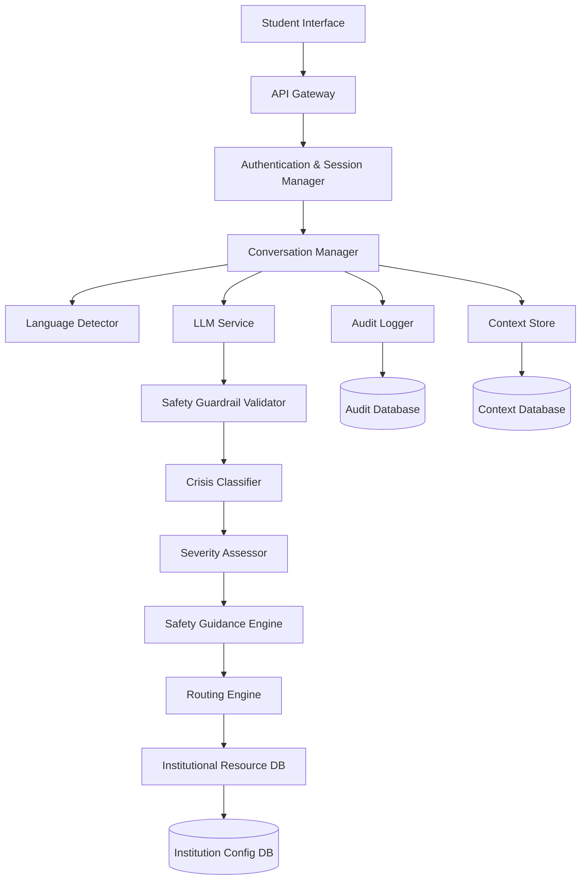

# Design Document: AI First Responder System

## Overview

The AI First Responder System is a safety-critical application that provides immediate crisis support to Indian students. The system architecture prioritizes safety, privacy, and rapid response through a layered approach combining LLM-based natural language understanding with deterministic rule-based safety guardrails and routing logic.

The system operates as a conversational AI that:
1. Accepts multilingual input (English/Hindi initially)
2. Classifies crisis type and severity using LLM with validation
3. Provides immediate safety guidance through rule-based templates
4. Routes students to appropriate institutional or external resources
5. Maintains privacy through encryption and minimal data collection
6. Logs interactions for accountability while protecting anonymity

## Architecture

### High-Level Architecture



### Component Layers

1. **Interface Layer**: Web/mobile interface for student interaction
2. **API Layer**: RESTful API with rate limiting and authentication
3. **Conversation Layer**: Manages session state, context, and conversation flow
4. **AI Layer**: LLM service with safety validation and crisis classification
5. **Logic Layer**: Deterministic safety guidance and routing engines
6. **Data Layer**: Encrypted storage for context, audit logs, and configuration

### Safety-First Design Principles

- **Rule-based overrides**: Critical safety scenarios use pre-approved responses
- **Validation gates**: All LLM outputs validated before delivery
- **Fail-safe defaults**: System defaults to human escalation when uncertain
- **Minimal data collection**: Only essential data stored, encrypted at rest
- **Audit everything**: All decisions logged for accountability

## Components and Interfaces

### 1. Student Interface

**Responsibility**: Provide accessible, multilingual UI for crisis communication

**Interface**:
```typescript
interface StudentInterface {
  // Send message to system
  sendMessage(message: string, sessionId: string): Promise<Response>
  
  // Receive system response
  onResponse(callback: (response: Response) => void): void
  
  // Switch language
  changeLanguage(language: Language): void
  
  // Request data deletion
  requestDataDeletion(sessionId: string): Promise<DeletionConfirmation>
}

type Language = 'en' | 'hi'

interface Response {
  message: string
  language: Language
  resources?: Resource[]
  urgencyLevel: SeverityLevel
}
```

### 2. API Gateway

**Responsibility**: Handle HTTP requests, rate limiting, and basic validation

**Interface**:
```typescript
interface APIGateway {
  // Process incoming message
  POST /api/v1/message
  Body: { message: string, sessionId?: string, language?: Language }
  Response: { responseId: string, message: string, resources: Resource[] }
  
  // Get session history
  GET /api/v1/session/:sessionId
  Response: { messages: Message[], crisisType?: CrisisType }
  
  // Delete user data
  DELETE /api/v1/session/:sessionId
  Response: { status: 'deleted', confirmationId: string }
  
  // Health check
  GET /api/v1/health
  Response: { status: 'healthy' | 'degraded', uptime: number }
}
```

### 3. Conversation Manager

**Responsibility**: Orchestrate conversation flow, maintain context, coordinate components

**Interface**:
```typescript
interface ConversationManager {
  // Process new message
  processMessage(input: MessageInput): Promise<ConversationResponse>
  
  // Retrieve conversation context
  getContext(sessionId: string): Promise<ConversationContext>
  
  // Update context
  updateContext(sessionId: string, update: ContextUpdate): Promise<void>
  
  // End conversation
  endConversation(sessionId: string): Promise<void>
}

interface MessageInput {
  message: string
  sessionId: string
  language?: Language
  timestamp: Date
}

interface ConversationContext {
  sessionId: string
  messages: Message[]
  crisisType?: CrisisType
  severityLevel?: SeverityLevel
  language: Language
  institutionId?: string
}
```

### 4. Language Detector

**Responsibility**: Identify language of student input

**Interface**:
```typescript
interface LanguageDetector {
  // Detect language from text
  detectLanguage(text: string): Promise<LanguageDetection>
}

interface LanguageDetection {
  language: Language
  confidence: number // 0.0 to 1.0
  fallback: Language // default if confidence low
}
```

### 5. LLM Service

**Responsibility**: Natural language understanding and response generation

**Interface**:
```typescript
interface LLMService {
  // Generate response to student message
  generateResponse(
    message: string,
    context: ConversationContext,
    language: Language
  ): Promise<LLMResponse>
  
  // Extract crisis information
  extractCrisisInfo(
    message: string,
    language: Language
  ): Promise<CrisisExtraction>
}

interface LLMResponse {
  text: string
  confidence: number
  crisisIndicators: string[]
}

interface CrisisExtraction {
  crisisType: CrisisType[]
  keywords: string[]
  urgencyIndicators: string[]
  selfHarmMentioned: boolean
  immediateDangerMentioned: boolean
}
```

### 6. Safety Guardrail Validator

**Responsibility**: Validate LLM outputs against safety rules, apply overrides

**Interface**:
```typescript
interface SafetyGuardrailValidator {
  // Validate LLM response
  validate(
    response: LLMResponse,
    context: ConversationContext
  ): Promise<ValidationResult>
  
  // Get override response for critical scenarios
  getOverrideResponse(
    crisisType: CrisisType,
    severityLevel: SeverityLevel,
    language: Language
  ): Promise<string>
}

interface ValidationResult {
  isValid: boolean
  violations: SafetyViolation[]
  shouldOverride: boolean
  overrideResponse?: string
}

interface SafetyViolation {
  rule: string
  severity: 'warning' | 'critical'
  description: string
}
```

### 7. Crisis Classifier

**Responsibility**: Classify crisis type from student input and LLM extraction

**Interface**:
```typescript
interface CrisisClassifier {
  // Classify crisis type
  classify(
    extraction: CrisisExtraction,
    context: ConversationContext
  ): Promise<CrisisClassification>
}

interface CrisisClassification {
  primaryType: CrisisType
  secondaryTypes: CrisisType[]
  confidence: number
  requiresClarification: boolean
}

type CrisisType = 
  | 'harassment'
  | 'ragging'
  | 'cyberbullying'
  | 'mental_health'
  | 'self_harm'
  | 'physical_threat'
```

### 8. Severity Assessor

**Responsibility**: Determine severity level (1-4) based on crisis classification

**Interface**:
```typescript
interface SeverityAssessor {
  // Assess severity level
  assess(
    classification: CrisisClassification,
    extraction: CrisisExtraction
  ): Promise<SeverityAssessment>
}

interface SeverityAssessment {
  level: SeverityLevel
  reasoning: string
  escalationRequired: boolean
}

type SeverityLevel = 1 | 2 | 3 | 4
```

### 9. Safety Guidance Engine

**Responsibility**: Provide immediate safety steps based on crisis type and severity

**Interface**:
```typescript
interface SafetyGuidanceEngine {
  // Get safety guidance
  getGuidance(
    crisisType: CrisisType,
    severityLevel: SeverityLevel,
    language: Language
  ): Promise<SafetyGuidance>
}

interface SafetyGuidance {
  immediateSteps: string[]
  doNotDo: string[]
  emergencyContacts: EmergencyContact[]
  additionalInfo: string
}

interface EmergencyContact {
  name: string
  phone: string
  available24x7: boolean
  type: 'police' | 'helpline' | 'ngo'
}
```

### 10. Routing Engine

**Responsibility**: Determine appropriate institutional/external resources

**Interface**:
```typescript
interface RoutingEngine {
  // Get routing recommendations
  route(
    crisisType: CrisisType,
    severityLevel: SeverityLevel,
    institutionId?: string
  ): Promise<RoutingRecommendation>
}

interface RoutingRecommendation {
  primaryResource: Resource
  alternativeResources: Resource[]
  reasoning: string
}

interface Resource {
  type: ResourceType
  name: string
  contactInfo: ContactInfo
  availability: string
  description: string
}

type ResourceType = 
  | 'icc'
  | 'anti_ragging_cell'
  | 'counselor'
  | 'police'
  | 'ngo'
  | 'helpline'

interface ContactInfo {
  phone?: string
  email?: string
  website?: string
  address?: string
}
```

### 11. Context Store

**Responsibility**: Persist and retrieve conversation context

**Interface**:
```typescript
interface ContextStore {
  // Save context
  save(context: ConversationContext): Promise<void>
  
  // Retrieve context
  get(sessionId: string): Promise<ConversationContext | null>
  
  // Delete context
  delete(sessionId: string): Promise<void>
  
  // Delete old contexts (90 days)
  deleteExpired(): Promise<number>
}
```

### 12. Audit Logger

**Responsibility**: Log all interactions for accountability

**Interface**:
```typescript
interface AuditLogger {
  // Log crisis interaction
  logInteraction(entry: AuditEntry): Promise<void>
  
  // Log access event
  logAccess(access: AccessEvent): Promise<void>
  
  // Query audit logs (admin only)
  query(filter: AuditFilter): Promise<AuditEntry[]>
}

interface AuditEntry {
  entryId: string
  timestamp: Date
  sessionId: string
  crisisType?: CrisisType
  severityLevel?: SeverityLevel
  routingDecision?: ResourceType[]
  responseTime: number
  languageUsed: Language
  // No PII unless explicitly provided
}

interface AccessEvent {
  timestamp: Date
  userId: string
  role: UserRole
  action: string
  resourceAccessed: string
}

type UserRole = 'student' | 'counselor' | 'administrator' | 'auditor'
```

### 13. Institutional Resource Database

**Responsibility**: Store and retrieve institution-specific resource configurations

**Interface**:
```typescript
interface InstitutionalResourceDB {
  // Get resources for institution
  getResources(institutionId: string): Promise<InstitutionResources>
  
  // Update resources (admin only)
  updateResources(
    institutionId: string,
    resources: InstitutionResources
  ): Promise<void>
  
  // Validate configuration completeness
  validateConfig(institutionId: string): Promise<ValidationResult>
}

interface InstitutionResources {
  institutionId: string
  institutionName: string
  icc: Resource
  antiRaggingCell: Resource
  counselors: Resource[]
  emergencyContacts: EmergencyContact[]
  customGuidance?: Record<CrisisType, string>
}
```

## Data Models

### Message

```typescript
interface Message {
  messageId: string
  sessionId: string
  sender: 'student' | 'system'
  content: string
  language: Language
  timestamp: Date
  encrypted: boolean
}
```

### Session

```typescript
interface Session {
  sessionId: string
  createdAt: Date
  lastActivityAt: Date
  language: Language
  institutionId?: string
  isAnonymous: boolean
  studentIdentifier?: string // encrypted if provided
  expiresAt: Date // 90 days from creation
}
```

### Crisis Event

```typescript
interface CrisisEvent {
  eventId: string
  sessionId: string
  crisisType: CrisisType[]
  severityLevel: SeverityLevel
  classifiedAt: Date
  routedTo: ResourceType[]
  guidanceProvided: string[]
  resolved: boolean
}
```

## Correctness Properties

*A property is a characteristic or behavior that should hold true across all valid executions of a system—essentially, a formal statement about what the system should do. Properties serve as the bridge between human-readable specifications and machine-verifiable correctness guarantees.*


### Property 1: Language Detection and Response Matching

*For any* student message in a supported language (English or Hindi), the system should detect the language and generate a response in the same language.

**Validates: Requirements 1.1**

### Property 2: Language Switch Adaptation with Context Preservation

*For any* ongoing conversation, when a student switches from one supported language to another, the system should respond in the new language while maintaining all conversation context including crisis classification and message history.

**Validates: Requirements 1.3, 1.5, 13.4**

### Property 3: Crisis Type Classification Validity

*For any* student crisis description, the crisis classifier should identify at least one crisis type from the valid set (harassment, ragging, cyberbullying, mental_health, self_harm, physical_threat).

**Validates: Requirements 2.1**

### Property 4: Severity Level Range Constraint

*For any* classified crisis, the assigned severity level should be an integer between 1 and 4 inclusive.

**Validates: Requirements 2.2**

### Property 5: Multiple Crisis Type Detection

*For any* crisis description containing indicators of multiple crisis types, the classifier should identify all applicable crisis types, not just the primary one.

**Validates: Requirements 2.3**

### Property 6: Critical Severity Assignment for Self-Harm and Immediate Danger

*For any* crisis involving self-harm indicators or immediate physical danger indicators, the severity assessor should assign severity level 4.

**Validates: Requirements 2.4**

### Property 7: Safety Guidance Provision

*For any* classified crisis with a known crisis type and severity level, the safety guidance engine should return non-empty immediate safety steps appropriate to that crisis type.

**Validates: Requirements 3.1**

### Property 8: Emergency Contact Inclusion for Critical Cases

*For any* crisis with severity level 4, the safety guidance should include at least one emergency contact (police, helpline, or NGO) marked as available 24x7.

**Validates: Requirements 3.2**

### Property 9: Self-Harm Helpline Provision

*For any* crisis classified as self_harm, the safety guidance should include at least one crisis helpline contact with a phone number.

**Validates: Requirements 3.3**

### Property 10: Crisis-Type-Based Routing

*For any* crisis classified as harassment, ragging, or mental_health, the routing engine should recommend the corresponding institutional resource (ICC for harassment, Anti_Ragging_Cell for ragging, Counselor for mental_health) as the primary or alternative resource.

**Validates: Requirements 4.1, 4.2, 4.3**

### Property 11: Police Routing for Critical Physical Danger

*For any* crisis with severity level 4 and crisis type physical_threat, the routing engine should include police emergency services in the recommended resources.

**Validates: Requirements 4.4**

### Property 12: Alternative Resource Provision

*For any* routing request where institutional resources are marked as unavailable, the routing engine should include at least one NGO or external helpline as an alternative resource.

**Validates: Requirements 4.5**

### Property 13: Multiple Resource Options

*For any* routing decision, the routing engine should provide at least one alternative resource in addition to the primary resource when multiple relevant resources exist.

**Validates: Requirements 4.6**

### Property 14: Anonymous Session PII Exclusion

*For any* session marked as anonymous, the stored session data should not contain personally identifiable information (name, email, phone, address).

**Validates: Requirements 5.2**

### Property 15: PII Encryption

*For any* session where a student voluntarily provides personally identifiable information, that information should be encrypted before storage, and the stored value should not match the plaintext value.

**Validates: Requirements 5.3**

### Property 16: Crisis Interaction Audit Logging

*For any* crisis interaction where a crisis type and severity level are determined, an audit log entry should be created containing timestamp, crisis type, severity level, and routing decision.

**Validates: Requirements 6.1**

### Property 17: Audit Log Encryption

*For any* audit log entry stored in the database, the entry should be encrypted at rest, verifiable by checking that the stored format is not plaintext.

**Validates: Requirements 6.2**

### Property 18: Audit Log PII Exclusion

*For any* audit log entry for an anonymous session, the entry should not contain personally identifiable information unless the student explicitly provided it during the conversation.

**Validates: Requirements 6.3**

### Property 19: Administrator Access Logging

*For any* administrator or auditor access to audit logs, an access event should be logged containing the user identity, timestamp, and resource accessed.

**Validates: Requirements 6.4**

### Property 20: Safety Rule Override for High-Risk Scenarios

*For any* crisis with severity level 4 or crisis type self_harm, the system should use a rule-based override response rather than a purely LLM-generated response, verifiable by checking that the response matches a pre-approved template.

**Validates: Requirements 7.1**

### Property 21: Response Validation Gate

*For any* LLM-generated response, the response should pass through the safety guardrail validator before being presented to the student, verifiable by checking that validation occurs in the processing pipeline.

**Validates: Requirements 7.2**

### Property 22: Safety Violation Response Replacement

*For any* LLM-generated response that violates safety rules (detected by the validator), the system should replace it with a pre-approved safe response before presenting to the student.

**Validates: Requirements 7.3**

### Property 23: Low Confidence Human Escalation

*For any* crisis classification or response generation with confidence below a threshold (e.g., 0.6), the system should recommend connecting with human support (counselor or helpline) in the response.

**Validates: Requirements 7.5**

### Property 24: Conversation Data Expiration

*For any* conversation session older than 90 days (unless explicitly extended by student opt-in), the conversation data should be deleted from the context store.

**Validates: Requirements 11.1**

### Property 25: Data Deletion Request Fulfillment

*For any* student data deletion request, all associated conversation data, session data, and non-audit information should be permanently deleted from the system within 7 days.

**Validates: Requirements 11.2**

### Property 26: Audit Log Separation from Conversation Data

*For any* conversation data deletion (either automatic or requested), the corresponding audit log entries should remain in the audit database and not be deleted.

**Validates: Requirements 11.3**

### Property 27: Data Deletion Confirmation

*For any* completed data deletion request, the system should return a confirmation with a unique confirmation ID to the student.

**Validates: Requirements 11.5**

### Property 28: Counselor Access Restriction

*For any* counselor user accessing the system, they should only be able to view crisis cases that were routed to counseling services, and should be denied access to cases routed to other resources.

**Validates: Requirements 12.2**

### Property 29: Auditor Read-Only Access

*For any* auditor user accessing audit logs, they should be able to read log entries but any attempt to modify or delete logs should be denied.

**Validates: Requirements 12.4**

### Property 30: Default-Deny Access Control

*For any* user attempting to access functionality not explicitly granted to their role, the access should be denied with an authorization error.

**Validates: Requirements 12.5**

### Property 31: Session Context Continuity

*For any* student message within an existing session, the system should have access to all previous messages and crisis classifications from that session when generating the response.

**Validates: Requirements 13.1**

### Property 32: Crisis Classification Persistence

*For any* conversation where a crisis type and severity level have been determined, those values should remain accessible in subsequent messages within the same session.

**Validates: Requirements 13.2**

### Property 33: Session Resumption Within 24 Hours

*For any* student returning to a previous session within 24 hours of the last activity, the system should offer to resume the conversation with preserved context.

**Validates: Requirements 13.3**

### Property 34: Context Summarization Preserves Crisis Details

*For any* conversation exceeding a context length threshold, when the system summarizes earlier messages, the summary should preserve the crisis type, severity level, and key safety concerns.

**Validates: Requirements 13.5**

### Property 35: Institution-Specific Resource Routing

*For any* routing decision for a student associated with a specific institution, the recommended resources should use the contact information configured for that institution, not generic or other institutions' contacts.

**Validates: Requirements 14.2**

### Property 36: Institutional Configuration Validation

*For any* institution configuration, before allowing routing recommendations, the system should validate that all required resources (ICC, Anti_Ragging_Cell, at least one Counselor) are configured with valid contact information.

**Validates: Requirements 14.5**

### Property 37: Feedback Survey Offering

*For any* crisis interaction that reaches a conclusion state (student indicates they have the help they need or conversation ends naturally), the system should offer an optional feedback survey.

**Validates: Requirements 15.1**

### Property 38: Anonymous Feedback Storage

*For any* feedback submitted by a student, the stored feedback should not contain personally identifiable information linking it to the specific student or session.

**Validates: Requirements 15.3**

### Property 39: Follow-Up Message Scheduling

*For any* student who opts in for follow-up check-ins, the system should schedule check-in messages at 24 hours and 7 days from the opt-in time.

**Validates: Requirements 15.5**

## Error Handling

### Error Categories

1. **Input Validation Errors**
   - Invalid language code
   - Empty or malformed message
   - Invalid session ID
   - Response: 400 Bad Request with error details

2. **Authentication/Authorization Errors**
   - Invalid credentials
   - Insufficient permissions for role
   - Expired session token
   - Response: 401 Unauthorized or 403 Forbidden

3. **External Service Errors**
   - LLM service timeout or failure
   - Database connection failure
   - Encryption service unavailable
   - Response: Fallback to rule-based responses, log error, retry with exponential backoff

4. **Classification Errors**
   - Unable to determine crisis type
   - Low confidence classification
   - Response: Ask clarifying questions, offer human escalation

5. **Data Errors**
   - Session not found
   - Context retrieval failure
   - Audit log write failure
   - Response: Create new session, log error, ensure audit failure doesn't block student response

### Error Handling Principles

1. **Safety First**: Never let errors prevent critical safety information from reaching students
2. **Graceful Degradation**: Fall back to rule-based responses if AI services fail
3. **Transparency**: Inform students when system capabilities are degraded
4. **Logging**: Log all errors for debugging while excluding PII
5. **Human Escalation**: Offer human support when system cannot confidently help

### Critical Path Protection

For severity level 4 cases:
- Use pre-approved response templates (no dependency on LLM)
- Provide emergency contacts even if routing engine fails
- Ensure audit logging failure doesn't block response delivery
- Implement circuit breakers for external services

## Testing Strategy

### Dual Testing Approach

The system requires both unit testing and property-based testing for comprehensive coverage:

- **Unit tests**: Verify specific examples, edge cases, error conditions, and integration points
- **Property tests**: Verify universal properties across all inputs through randomization

Unit tests should focus on:
- Specific crisis scenarios (e.g., "I am being ragged by seniors" → ragging classification)
- Edge cases (empty input, language detection failure, malformed data)
- Error conditions (service timeouts, database failures)
- Integration between components

Property tests should focus on:
- Universal correctness properties (all 39 properties defined above)
- Comprehensive input coverage through randomization
- Invariants that must hold across all executions

### Property-Based Testing Configuration

**Framework Selection**:
- **TypeScript/JavaScript**: Use `fast-check` library
- **Python**: Use `hypothesis` library
- **Java**: Use `jqwik` library

**Test Configuration**:
- Minimum 100 iterations per property test (due to randomization)
- Each property test must reference its design document property
- Tag format: `Feature: ai-first-responder, Property {number}: {property_text}`

**Example Property Test Structure** (TypeScript with fast-check):

```typescript
import fc from 'fast-check';

// Feature: ai-first-responder, Property 1: Language Detection and Response Matching
describe('Property 1: Language Detection and Response Matching', () => {
  it('should respond in the same language as the input', async () => {
    await fc.assert(
      fc.asyncProperty(
        fc.record({
          message: fc.string({ minLength: 1 }),
          language: fc.constantFrom('en', 'hi')
        }),
        async ({ message, language }) => {
          const response = await system.processMessage({
            message,
            sessionId: generateSessionId(),
            language
          });
          
          expect(response.language).toBe(language);
        }
      ),
      { numRuns: 100 }
    );
  });
});
```

### Test Data Generation

For property-based tests, generate:
- Random crisis descriptions with varying severity indicators
- Random session contexts with different conversation histories
- Random institutional configurations
- Random user roles and permissions
- Random language combinations (English/Hindi)

### Integration Testing

Test integration points:
- API Gateway → Conversation Manager
- Conversation Manager → LLM Service → Safety Validator
- Crisis Classifier → Severity Assessor → Routing Engine
- Context Store ↔ Database
- Audit Logger ↔ Database

### Safety Testing

Critical safety scenarios to test:
- Self-harm mentions always trigger severity 4 and helpline provision
- Physical danger always triggers police recommendation
- Rule-based overrides always supersede LLM responses for high-risk cases
- Safety validator catches and blocks harmful suggestions

### Performance Testing

While not part of unit/property tests:
- Load testing for 3-second response time requirement
- Stress testing for priority handling of severity 4 cases
- Endurance testing for 24x7 availability

### Security Testing

- Penetration testing for authentication/authorization
- Encryption verification for PII and audit logs
- Access control testing for role-based permissions
- Data deletion verification (ensure irrecoverability)
